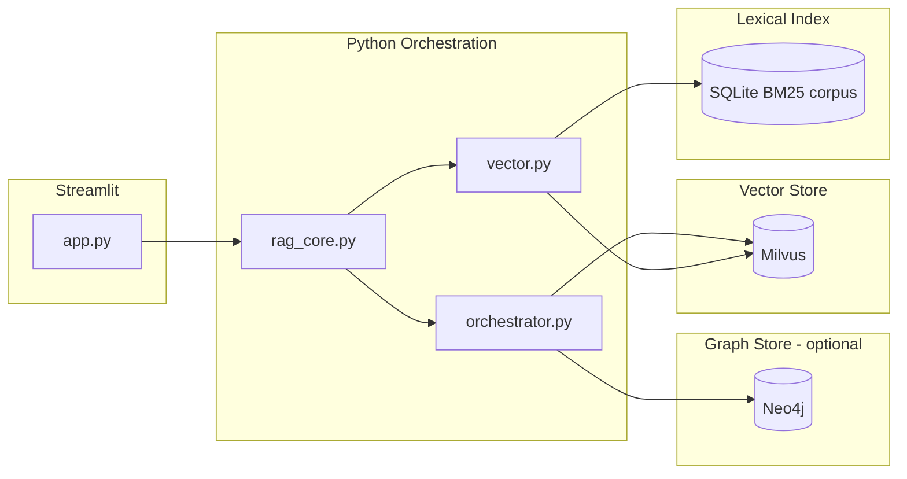
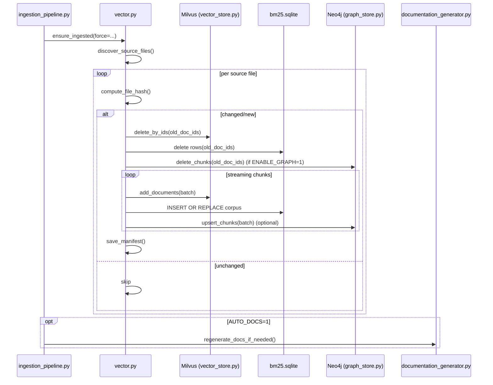
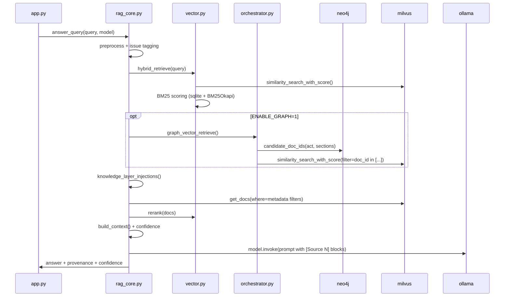

# LegalAid-AI Agent - Technical Documentation (One-Time, Human Authored)

This document explains what each part of the repository does, how the system works end-to-end, and why the major engineering choices were made. It is intentionally *not* auto-generated (unlike `docs/ARCHITECTURE.md`).

## Table of Contents
- Goals and Non-Goals
- High-Level Architecture
- Data Flows (Ingestion + Query)
- Repository Tour
- Module Deep Dive
- Why These Technology Choices
- Data Model
- Ingestion Pipeline
- Query Pipeline
- Milvus Layer Details
- Deployment and Operations
- Migration Utilities (Chroma -> Milvus)
- Known Gaps / Notes
- Suggested Next Hardening Steps

## Goals and Non-Goals

### Goals
- Provide a robust local-first Legal RAG system for Indian-law content.
- Preserve source fidelity: answers should be grounded in retrieved context with explicit citations.
- Scale ingestion/retrieval beyond what an embedded DB can comfortably handle.
- Support structured metadata (Act/Section/etc.) for deterministic retrieval and filtering.
- Keep the system operable on a single developer machine (Docker + Python).

### Non-goals
- This repository does not attempt to be a full legal expert system or provide legal advice.
- This repository does not implement a full production observability stack (it provides hooks and sane logging, not dashboards).

## High-Level Architecture

The system is a Hybrid RAG:
- **Vector layer (Milvus)**: semantic similarity search over chunk embeddings + server-side metadata filters.
- **Lexical layer (BM25)**: keyword matching (strong for statutory phrases and exact terms).
- **Graph layer (Neo4j, optional)**: structure-aware candidate generation (Act/Section neighborhood) to improve precision/recall for statute-heavy queries.
- **Orchestration layer (Python)**: query analysis, hybrid retrieval, deterministic "knowledge injection", reranking, confidence scoring, context construction.
- **LLM synthesis (Ollama)**: local generation constrained by a citation-first prompt contract.
- **UI (Streamlit)**: interactive chat + controls to rebuild the index and inspect basic health.

## Data Flows (Ingestion + Query)

### Ingestion sequence

### Query sequence

## Repository Tour

### Top-level Python modules
- `app.py`: Streamlit frontend (chat UI + index controls).
- `rag_core.py`: the RAG pipeline (query analysis, retrieval orchestration, context building, prompting, confidence + provenance).
- `vector.py`: ingestion + retrieval utilities:
  - incremental ingestion manifest
  - PDF/MD/JSON loaders and chunkers
  - Milvus vector store initialization
  - BM25 corpus persistence in SQLite
  - optional Neo4j graph writes during ingestion
  - hybrid retrieve (vector + BM25) and reranking
- `vector_store.py`: Milvus adapter (pymilvus) exposing a Chroma-like filter interface to avoid breaking the rest of the pipeline.
- `graph_store.py`: Neo4j adapter + minimal legal graph schema (Act/Section/Chunk and citation edges).
- `orchestrator.py`: optional graph-augmented retrieval that restricts Milvus search to graph candidates.
- `ingestion_pipeline.py`: CLI entrypoint to run ingestion and (optionally) regenerate the auto `docs/ARCHITECTURE.md`.
- `documentation_generator.py`: auto-doc generator for `docs/ARCHITECTURE.md` (kept separate from this manual doc).
- `generation.py`: robust PDF/JSON -> Markdown converter (preprocessing tool for cleaner sources).
- `main.py`: a simple CLI chat runner with a JSON cache.

### Folders
- `pdfs/`: primary document sources used for ingestion (`.pdf`, `.md`, `.json`).
- `chrome_langchain_db/`: local persistent state:
  - `ingest_manifest.json` tracks incremental ingestion by file hash
  - `bm25.sqlite` stores the BM25 corpus texts + metadata
  - `embed_dim.json` caches the embedding dimension probe
- `infra/`: Docker Compose deployment for Milvus + Neo4j (+ Attu UI).
- `scripts/`: one-off utilities (not part of the runtime serving path).
- `docs/`: documentation (auto and manual).

## Module Deep Dive (What Each File Does and Why)

### `app.py` (Streamlit UI)
What it does:
- Provides a chat UX (`st.chat_input`) and renders Q/A turns plus optional retrieved sources.
- Exposes operational controls:
  - "Rebuild Index" button calls `vector.rebuild_index()` (drops Milvus collection, resets manifest and BM25 corpus).
  - "Index" panel shows `vector.index_status()` (count + errors).
- Provides optional voice UX:
  - Browser speech-to-text UI (manual copy/paste due to Streamlit component return limitations).
  - Optional server-side transcription via OpenAI Whisper if `openai` is installed and `OPENAI_API_KEY` is present.

Why this shape:
- Streamlit reruns make global state tricky; this UI delegates all persistence and concurrency to `vector.py` (locks + manifest).
- The UI keeps the system operable without requiring a separate backend service.

### `ingestion_pipeline.py` (CLI ingestion entrypoint)
What it does:
- Calls `vector.ensure_ingested(force=...)`.
- Optionally sets `ENABLE_GRAPH=1` for the run (via a CLI flag).
- Optionally regenerates the auto architecture doc (`docs/ARCHITECTURE.md`).

Why this exists:
- Separates "operational ingestion" from the UI, so ingestion can be run in CI, scheduled jobs, or manual maintenance.

### `vector.py` (Ingestion + Retrieval Utilities)
What it does:
- Owns the "data plane" for documents:
  - load and chunk `.pdf`, `.md`, `.json`
  - infer metadata (Act/Chapter/Section/etc.)
  - create stable `doc_id`s
  - upsert to Milvus and update BM25 + graph (optional)
  - maintain an incremental ingestion manifest
- Owns hybrid retrieval:
  - `hybrid_retrieve()` merges Milvus similarity and BM25 keyword hits
  - `rerank()` adds authority-aware prioritization

Why it is centralized:
- Streamlit's execution model and local-first goals favor a single module that owns ingestion state (manifest, BM25 corpus, vector store singleton, locks).
- Keeping ingestion + retrieval in one place reduces schema drift across components.

### `vector_store.py` (Milvus adapter)
What it does:
- Defines a Milvus schema that preserves `doc_id` as a primary key.
- Converts a subset of Chroma-like filter dicts into Milvus expressions.
- Provides the minimal methods the rest of the pipeline depends on:
  - add/upsert with explicit embeddings (needed for migration)
  - similarity search with metadata filters
  - deterministic metadata queries (`get_docs`)

Why a custom adapter:
- The project previously depended on Chroma semantics; this layer keeps filters stable and avoids ripple changes in `rag_core.py`.

### `rag_core.py` (RAG orchestration)
What it does:
- Performs query analysis and routing:
  - overview detection vs clause/enforceability vs general Q&A
  - issue tagging, query expansion, and source boosts
- Builds the retrieval pool via multiple stages:
  - hybrid retrieval (vector + BM25)
  - optional graph-augmented retrieval
  - deterministic "knowledge injection" via metadata queries
  - recall/rescue expansion when confidence is low
- Applies dedup + rerank + strict context budgets, then runs LLM synthesis with a citation contract.
- Computes and appends confidence/provenance to every answer.

Why it is structured this way:
- Legal RAG benefits from deterministic anchors (sections, Acts) layered on top of embeddings.
- Precision-first reduces hallucinations; controlled expansion improves recall only when needed.

### `graph_store.py` and `orchestrator.py` (optional graph retrieval)
What they do:
- `graph_store.py` writes and queries Neo4j:
  - Act/Section/Chunk nodes
  - constraints for uniqueness
  - heuristic `CITES` edges from section refs
- `orchestrator.py` uses Neo4j to produce candidate `doc_id`s and restricts Milvus retrieval to that set when feasible.

Why optional:
- Graph databases add operational complexity. Making this path env-guarded keeps the system usable on vector-only deployments.

### `generation.py` (PDF/JSON -> Markdown converter)
What it does:
- Converts noisy PDFs and JSON sources to clean Markdown for higher-quality ingestion.
- Handles multilingual text and OCR with Hindi+English, plus header/footer stripping.

Why it is separated from ingestion:
- Ingestion must be reliable and fast for frequent runs; heavy cleanup and OCR at conversion time can be performed offline and checked into `pdfs/` as `.md`.

### `documentation_generator.py` (auto architecture doc)
What it does:
- Rebuilds `docs/ARCHITECTURE.md` from the current repo/config signature.
- Avoids importing heavy runtime modules; reads embed dim from env or the local cache file.

Why it exists:
- Keeps a "living", code-synced architecture snapshot, while this manual document explains the deeper reasoning and trade-offs.

### `scripts/migrate_chroma_to_milvus.py` (one-time migration utility)
What it does:
- Reads a persistent Chroma collection (ids, docs, metadatas, embeddings).
- Writes those entries into Milvus while preserving:
  - ids
  - vectors (recomputed only if missing)
  - metadata (including Unicode/Hindi)
- Supports batch migration, retries, and a progress file for resumability.

Why it exists:
- Migration is operational, not part of serving. Keeping it in `scripts/` avoids runtime coupling to Chroma but still provides a safe path for historical data.

### `infra/docker-compose.yml` and `infra/.env.example` (local deployment)
What they do:
- Provide a reproducible local stack for Milvus (etcd + MinIO + Milvus standalone), optional Attu UI, and Neo4j.
- Define environment variables for Python and container configuration.

Why Docker Compose:
- Keeps the system easy to run on a single machine while using production-like components (Milvus and Neo4j as real services).

### `main.py` (minimal CLI runner)
What it does:
- Runs a terminal Q/A loop against `rag_core.answer_query()`.
- Persists a simple `query_cache.json` with a 7-day TTL and basic cache hygiene.

Why it exists:
- Makes it easy to test retrieval/synthesis outside Streamlit and without a browser.

## Why These Technology Choices

### Why Milvus (instead of Chroma)
Milvus is chosen for better scaling and operational characteristics once you outgrow an embedded store:
- richer index options (HNSW, IVF variants, auto-index)
- durable persistence via external storage (MinIO + etcd in standalone compose)
- more mature server-side filtering and search controls at larger corpus sizes

Trade-offs:
- more services to run/monitor (Milvus depends on etcd + MinIO in this stack)
- schema/index management becomes part of operations

### Why keep BM25 (hybrid retrieval)
Legal queries often depend on exact statutory phrasing (e.g., "restraint of trade", "liquidated damages", "Section 27"), where lexical matching is strong.

This repository keeps a BM25 layer:
- to recover results that semantic embeddings miss (especially for short or jargon-heavy queries)
- to provide deterministic keyword coverage even if vector search temporarily fails

BM25 is stored locally in SQLite for reliability and fast incremental updates (you do not want to rebuild BM25 by scanning Milvus on every run).

### Why Neo4j (optional graph layer)
For statute-heavy questions, a graph helps constrain retrieval to:
- the right Act
- the right Section neighborhood
- sections cited by the relevant sections (heuristic `CITES`)

The graph is **optional** and guarded by `ENABLE_GRAPH=1`. If Neo4j is down, the system degrades to vector+BM25 retrieval.

### Why a custom Milvus adapter (instead of only LangChain's wrapper)
`vector_store.py` intentionally implements a minimal adapter with:
- stable `doc_id` primary keys
- Chroma-like `where` filters (`{"act":"..."}`, `{"$and":[...]}`, `{"field":{"$in":[...]}}`)

This isolates the rest of the code from LangChain wrapper churn and preserves filter semantics during the migration.

## Data Model

### Stable Document IDs
During ingestion, each chunk gets a stable ID:

`doc_id = "{relative_path}:{chunk_index}:{file_hash_prefix}"`

This has two important properties:
- it is stable for a specific file version and chunk position
- if the file changes, the hash prefix changes, so new chunks do not collide with old chunks and the manifest-driven deletion path can cleanly remove prior content

### Milvus Collection Schema
The Milvus collection stores:
- `doc_id` (primary key, VARCHAR)
- `embedding` (FloatVector, dimension inferred and cached)
- `text` (chunk text)
- typed metadata fields for common filters: `doc_type`, `source`, `source_path`, `act`, `chapter`, `section`, `subsection`, `clause`, `citation`, `char_count`
- `metadata_json` (full metadata JSON, to preserve forward compatibility and reduce schema churn)

### Neo4j Graph Schema (superset for chunk-level retrieval)
Nodes:
- `(:Act {name})`
- `(:Section {key, act, section, subsection, clause, citation})`
- `(:Chunk {doc_id, source, source_path, doc_type, text})`

Relationships:
- `(Act)-[:HAS_SECTION]->(Section)`
- `(Section)-[:HAS_CHUNK]->(Chunk)`
- `(Section)-[:CITES]->(Section)` (heuristic extraction from chunk text)

The graph exists to produce a candidate `doc_id` set for retrieval-time filtering; the final ranking and synthesis still happens in the RAG pipeline.

## Ingestion Pipeline (How Data Gets Into the System)

### Source discovery
`vector.py` ingests:
- root JSON datasets listed in `JSON_FILES`
- files under `pdfs/` with extensions in `SUPPORTED_EXTENSIONS = {".pdf", ".md", ".json"}`

### Incremental ingestion via manifest
The ingestion manifest (`chrome_langchain_db/ingest_manifest.json`) maps:
- relative file path -> `hash` + list of produced `doc_id`s

At ingest time:
- compute file hash
- if unchanged, skip
- if changed, delete old `doc_id`s from Milvus, delete matching BM25 rows, delete matching Neo4j Chunk nodes (if enabled)
- stream the file into chunks, batch insert into Milvus, update BM25 and graph in the same batches

This is designed to be memory-safe for large corpora and tolerant of partial failures.

### PDF ingestion and OCR fallback
PDFs are first loaded via `PyPDFLoader` and normalized. If the text quality is poor (short text, low space ratio, suspicious average word length), OCR is attempted:
- OCR uses `pdf2image` + `pytesseract`
- OCR language pack: `eng+hin` (English + Hindi)
- normalization runs after OCR to reduce common noise (missing spaces, hyphenation, weird artifacts)

Operational note: OCR dependencies are intentionally *lazy-imported* so the system can still run even if OCR tooling is not installed.

### Markdown ingestion
Markdown is read as UTF-8, stripped of code fences/backticks, normalized, and chunked. Basic heuristics convert numeric headings into `Section N` style anchors so that metadata extraction and retrieval behave more like statutes.

### JSON ingestion
The JSON loader supports multiple shapes:
- Q&A objects with `"question"` and `"answer"` (stored with `doc_type="qa"` and chunked using a Q&A-aware splitter)
- CSV-in-JSON rows (a known dataset format)
- a fallback mode that concatenates string-like values

Metadata extraction uses regex heuristics to infer Act/Chapter/Section/Subsection/Clause/Citation.

### Batch size and throughput
Ingestion batches are intentionally conservative:
- `BATCH_SIZE = 32` for embedding requests to avoid Ollama memory spikes.

### Optional: Pre-clean sources with `generation.py`
`generation.py` is a standalone preprocessing tool that converts `.pdf` and `.json` into cleaner `.md` while handling:
- multilingual content (Unicode normalization, Hindi/English mixing)
- header/footer removal (cross-page repetition detection)
- OCR fallback and normalization
- list/table reconstruction where possible

This is recommended when your PDFs have heavy header/footer noise or scanned pages; cleaner Markdown improves chunking and retrieval quality.

## Query Pipeline (How Questions Become Answers)

The core query pipeline is `rag_core.answer_query()`. The design is "precision-first, then expand for recall" to reduce hallucinations and keep context grounded.

### 1) Input validation and injection guardrails
The query is validated (non-empty, max length). It also rejects obvious prompt injection patterns such as "ignore instruction" or "system prompt".

### 2) Query type detection
The system distinguishes:
- **overview queries** ("what is", "overview", "summary", etc.)
- **clause enforceability queries** ("is this clause legal/valid/enforceable?")

These change retrieval breadth (`retrieval_k`) and the prompt template used for synthesis.

### 3) Query preprocessing, tagging, and expansion
The query is normalized and "issue tags" are detected (contract concepts, non-compete, arbitration, evidence, civil procedure, etc.). These tags drive:
- query variants (a small set of high-signal paraphrases + statutory anchors)
- source boosts (restricting retrieval to a likely Act/source file)
- deterministic statute injections

### 4) Retrieval stages
Retrieval is a pool-building process:
- **Base hybrid retrieval**: `vector.hybrid_retrieve()` merges Milvus similarity hits with BM25 hits and scores them (60% vector / 40% BM25).
- **Graph-augmented retrieval (optional)**: if `ENABLE_GRAPH=1`, the orchestrator:
  - extracts Act and section refs from the query
  - asks Neo4j for candidate `doc_id`s
  - runs Milvus search restricted to those candidates (when the candidate set is below a cap)
  - backfills from global vector retrieval if the strict filter is too narrow
- **Knowledge-layer injection**: deterministic fetching of specific sections by metadata, based on issue tags and explicit "Section N" references. This helps with statute recall when embeddings miss exact legal phrasing.
- **Source-filtered retrieval**: additional recall by searching only within likely source files when needed.

### 5) Relevance filtering, dedup, rerank
The pipeline assigns a relevance score per document (phrase match + term coverage + citation hints), filters by a threshold, then:
- ensures a minimum-size pool
- deduplicates near-duplicates (doc_id or Jaccard similarity on tokens)
- applies authority-aware reranking:
  - statutes (pdf/md/json) generally outrank Q&A
  - section-bearing chunks outrank vague chunks
  - query token overlap adds relevance so "authority" does not dominate everything

### 6) Context building with strict budgets
Context is constructed as `[Source N: ...]` blocks with:
- per-doc truncation (`MAX_DOC_CHARS`)
- global context truncation (`MAX_CONTEXT_CHARS`, with a larger budget for overview queries)

For overview queries, the context builder attempts to include:
- definitional/structural sections (short title, extent, definitions, etc.)
- early section numbers where possible (heuristic breadth)

### 7) LLM synthesis (citation contract)
The system uses different prompt templates depending on the query type (standard, clause enforceability, overview). The templates enforce:
- "use ONLY the provided legal context"
- citations after each paragraph using `[Source N]`
- a strict "Not found in retrieved sources." response when evidence is missing

After generation, the system checks citation hygiene:
- if citations are missing, confidence is clamped and a warning is appended
- if citations exist but are inconsistent, it appends a verification note

### 8) Confidence scoring and provenance footer
Confidence is a heuristic in `[0, 1]` based on:
- how many statutory sources are present
- whether section-level citations exist
- whether multiple sources are present

Every answer gets a footer:
- provenance label (RAG vs general knowledge fallback)
- qualitative confidence label (High/Medium/Limited/Low)

## Milvus Layer Details

### Indexing and search parameters
Default choices are tuned for interactive latency:
- Index: `HNSW` with `M=16`, `efConstruction=200`
- Search: `ef=64` for HNSW

These are solid defaults for small-to-medium corpora. For multi-million chunk corpora, IVF variants can be more memory-efficient but require tuning (`nlist`, `nprobe`).

### Metadata filtering
The adapter converts a subset of Chroma-style filters into Milvus expressions:
- equality (`{"act": "Indian Contract Act"}`)
- `$and` / `$or`
- `$in` lists (used for `doc_id in [...]` filtering)

Typed metadata fields exist for the most common filters, while `metadata_json` preserves everything else.

### Embedding dimension handling
Embedding dimension is handled robustly:
- prefer cached `chrome_langchain_db/embed_dim.json`
- else accept an explicit `EMBEDDING_DIM` env override
- else probe the embedder once (`infer_embedding_dim()`), then cache it

This prevents "dimension mismatch" failures when services restart or models are swapped.

## Deployment and Operations

### Local deployment (Docker Compose)
`infra/docker-compose.yml` runs:
- Milvus standalone + dependencies (etcd, MinIO)
- Attu UI for Milvus inspection
- Neo4j for the graph layer

Typical local flow:
1. Start services: `docker compose -f infra/docker-compose.yml --env-file infra/.env up -d`
2. Run ingestion: `python ingestion_pipeline.py`
3. Run app: `streamlit run app.py`

### Environment variables
See `infra/.env.example`. Key toggles:
- `ENABLE_GRAPH=1` enables Neo4j writes + graph-augmented retrieval
- `AUTO_DOCS=0` disables auto-regeneration of `docs/ARCHITECTURE.md`

### Failure handling and degrade modes
- If Milvus index creation fails, the system logs and continues (queries may be slower).
- If Milvus search transiently fails, hybrid retrieval retries vector search and can fall back to BM25-only results.
- If Neo4j is unavailable, graph retrieval is disabled and the system continues with vector+BM25.
- If OCR dependencies are missing, PDF ingestion runs text-only and continues.

### Persistence and backups
- Milvus persistence is in Docker volumes (`milvus_data`, plus MinIO/etcd volumes).
- Neo4j persistence is in Docker volumes (`neo4j_data`, `neo4j_logs`).
- Local Python state is under `chrome_langchain_db/` (manifest, BM25, embedding dim cache).

## Migration Utilities (Chroma -> Milvus)

The migration utility is `scripts/migrate_chroma_to_milvus.py`. It:
- reads a persistent Chroma collection
- exports ids, embeddings, documents, metadata
- inserts into Milvus while preserving:
  - document IDs
  - embeddings (recomputed only if missing)
  - metadata (including Unicode)
- supports retry logic and a progress file for resumability

This script exists so the runtime system does not need a dependency on Chroma, but the repository currently retains the dependency for migration and compatibility.

## Known Gaps / Notes

- `test_performance.py` references `vector.retriever`, which is not present in the current codebase; it likely predates the Milvus refactor.
- Some files contain mojibake characters (e.g., `—`, `…`) which typically indicates a UTF-8/CP1252 display mismatch. The core pipeline uses UTF-8 reads/writes and `ensure_ascii=False` for JSON where possible, but you may want to normalize file encodings in your editor/terminal for clean UI output.

## Suggested Next Hardening Steps (If You Move Toward Production)

- Add structured configuration (pydantic settings) and a single config module to avoid env var drift.
- Add a "readiness check" endpoint for Milvus/Neo4j/Ollama.
- Add unit tests for:
  - manifest-based incremental ingestion behavior
  - `_dict_to_expr()` filter translation
  - rag_core citation hygiene utilities
- Add a background ingestion job + queue if ingestion becomes frequent.
- Add proper secrets management (do not pass DB passwords as plain env vars in real deployments).
