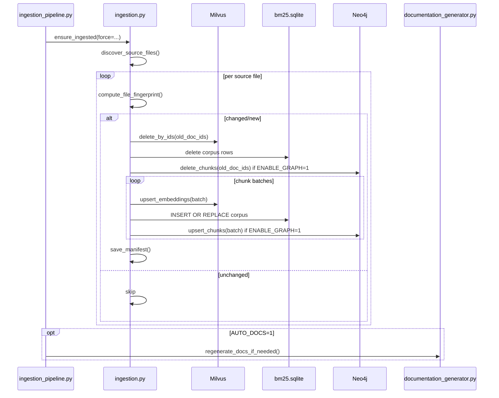
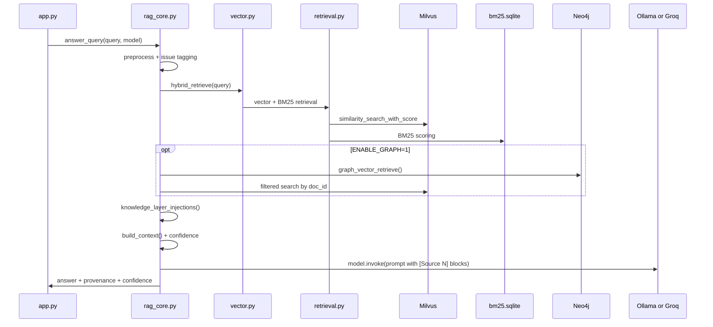
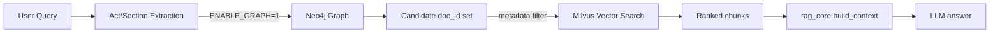
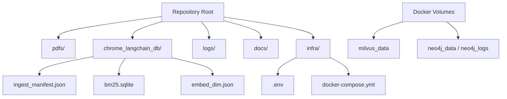
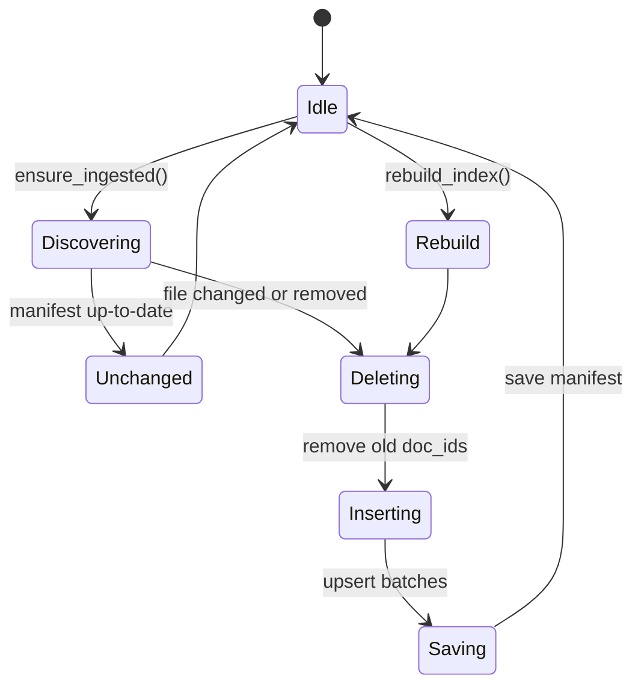
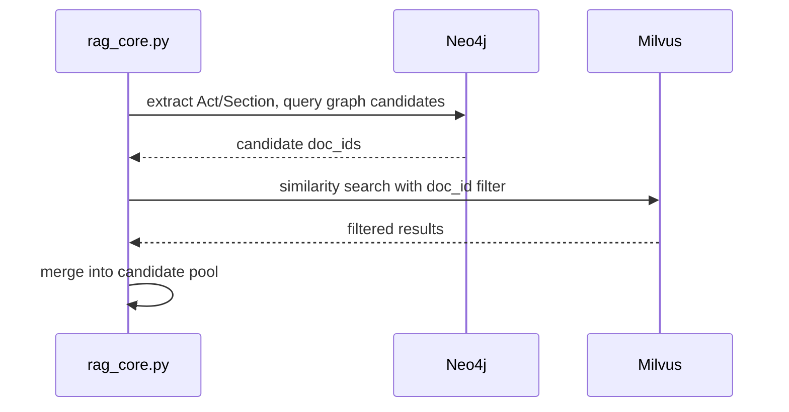
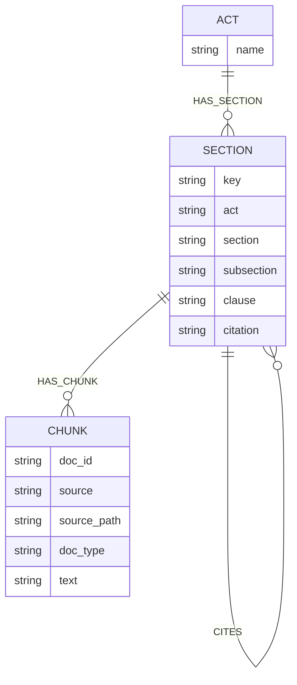

# LegalAid-AI Agent (NyayGram)

Local-first hybrid Retrieval-Augmented Generation (RAG) system for Indian law. It combines semantic search (Milvus), lexical search (BM25), and an optional graph layer (Neo4j) to produce grounded answers with explicit citations.

## Table of Contents
- Overview
- Quick Start
- Architecture
- Data Flows
- Additional Diagrams
- Repository Map
- Ingestion Pipeline
- Retrieval and Answering Pipeline
- Data Model
- Storage and State
- Configuration
- Deployment
- Operations and Troubleshooting
- Development Notes

## Overview

Core goals:
- Ground answers in retrieved legal sources with explicit citations.
- Support both exact statutory matching and semantic similarity.
- Scale ingestion and retrieval beyond an embedded database.
- Keep the system usable on a single developer machine.

Core components:
- Streamlit UI for chat and index operations.
- Python orchestration layer for hybrid retrieval, reranking, and prompting.
- Milvus vector store for semantic search and metadata filtering.
- BM25 SQLite corpus for lexical recall.
- Optional Neo4j graph for statute-aware retrieval.

Docs:
- `docs/ARCHITECTURE.md` is auto-generated and updated by `documentation_generator.py` when `AUTO_DOCS=1`.
- `docs/TECHNICAL_DOCUMENTATION.md` is a longer-form deep dive reference.

## Quick Start

### Option A: Docker-backed stack (recommended)

1. Copy the environment template:

```powershell
Copy-Item infra/.env.example infra/.env
```

2. Start the Docker stack (Milvus, Neo4j, and dependencies):

```powershell
docker compose -f infra/docker-compose.yml --env-file infra/.env up -d --build
```

3. Create a virtual environment and install dependencies:

```powershell
python -m venv venv
venv\Scripts\Activate.ps1
pip install -r requirements.txt
```

4. Run the app:

```powershell
streamlit run app.py
```

5. Optional: force ingestion explicitly:

```powershell
python ingestion_pipeline.py
```

### Option B: Use existing services

1. Set your environment variables for Milvus and (optionally) Neo4j.
2. Create a virtual environment and install dependencies.
3. Run the app with `streamlit run app.py`.

Notes:
- The first query triggers ingestion automatically.
- To run without Neo4j, leave `ENABLE_GRAPH=0` (default) and do not start the graph profile.

## Architecture

```
flowchart LR
  subgraph UI[User Interface]
    ST[Streamlit app.py]
  end

  subgraph CORE[RAG Orchestration]
    RC[rag_core.py]
    V[vector.py]
    R[retrieval.py]
    ING[ingestion.py]
  end

  subgraph STORES[Stores]
    MV[(Milvus Vector Store)]
    BM[(BM25 SQLite)]
    GS[(Neo4j Graph - optional)]
  end

  subgraph LLM[LLM Provider]
    OLL[Ollama]
    GRQ[Groq API (optional)]
  end

  ST --> RC
  RC --> V
  V --> R
  V --> ING
  ING --> MV
  ING --> BM
  ING --> GS
  R --> MV
  R --> BM
  RC --> GS
  RC --> OLL
  RC -.-> GRQ
```

## Data Flows

### Ingestion sequence


```mermaid
sequenceDiagram
  participant CLI as ingestion_pipeline.py
  participant ING as ingestion.py
  participant MV as Milvus
  participant BM as bm25.sqlite
  participant GS as Neo4j
  participant DOC as documentation_generator.py

  CLI->>ING: ensure_ingested(force=...)
  ING->>ING: discover_source_files()
  loop per source file
    ING->>ING: compute_file_fingerprint()
    alt changed/new
      ING->>MV: delete_by_ids(old_doc_ids)
      ING->>BM: delete corpus rows
      ING->>GS: delete_chunks(old_doc_ids) if ENABLE_GRAPH=1
      loop chunk batches
        ING->>MV: upsert_embeddings(batch)
        ING->>BM: INSERT OR REPLACE corpus
        ING->>GS: upsert_chunks(batch) if ENABLE_GRAPH=1
      end
      ING->>ING: save_manifest()
    else unchanged
      ING->>ING: skip
    end
  end
  opt AUTO_DOCS=1
    CLI->>DOC: regenerate_docs_if_needed()
  end
```

### Query sequence


```mermaid
sequenceDiagram
  participant UI as app.py
  participant RC as rag_core.py
  participant V as vector.py
  participant R as retrieval.py
  participant MV as Milvus
  participant BM as bm25.sqlite
  participant GS as Neo4j
  participant LLM as Ollama or Groq

  UI->>RC: answer_query(query, model)
  RC->>RC: preprocess + issue tagging
  RC->>V: hybrid_retrieve(query)
  V->>R: vector + BM25 retrieval
  R->>MV: similarity_search_with_score
  R->>BM: BM25 scoring
  opt ENABLE_GRAPH=1
    RC->>GS: graph_vector_retrieve()
    RC->>MV: filtered search by doc_id
  end
  RC->>RC: knowledge_layer_injections()
  RC->>RC: build_context() + confidence
  RC->>LLM: model.invoke(prompt with [Source N] blocks)
  RC->>UI: answer + provenance + confidence
```

## Additional Diagrams

### Graph Retrieval View (Optional)


```mermaid
flowchart LR
  Q[User Query] --> TAG[Act/Section Extraction]
  TAG -->|ENABLE_GRAPH=1| NEO[Neo4j Graph]
  NEO --> CANDS[Candidate doc_id set]
  CANDS -->|metadata filter| MV[Milvus Vector Search]
  MV --> DOCS[Ranked chunks]
  DOCS --> RC[rag_core build_context]
  RC --> LLM[LLM answer]
```

### Deployment Topology

```mermaid
flowchart TB
  subgraph HOST[Developer Machine]
    UI[Browser UI]
    APP[Streamlit app.py]
    OLL[Ollama (host)]
  end

  subgraph DOCKER[Docker Compose Network]
    MV[(Milvus)]
    ETCD[(etcd)]
    MINIO[(MinIO)]
    NEO[(Neo4j - optional)]
  end

  UI --> APP
  APP --> MV
  APP --> NEO
  APP --> OLL
  MV --> ETCD
  MV --> MINIO
```

### Storage Layout


```mermaid
flowchart TB
  ROOT[Repository Root]
  ROOT --> PDFS[pdfs/]
  ROOT --> DB[chrome_langchain_db/]
  DB --> MAN[ingest_manifest.json]
  DB --> BM25[bm25.sqlite]
  DB --> DIM[embed_dim.json]
  ROOT --> LOGS[logs/]
  ROOT --> DOCS[docs/]
  ROOT --> INFRA[infra/]
  INFRA --> ENV[.env]
  INFRA --> COMPOSE[docker-compose.yml]

  VOLS[Docker Volumes]
  VOLS --> MVDATA[milvus_data]
  VOLS --> NEO4J[neo4j_data / neo4j_logs]
```

### Configuration Resolution Flow

```mermaid
flowchart TD
  START[Start app / ingestion]
  START --> ENV[Read environment variables]
  ENV --> CFG[Build config objects]
  CFG -->|Milvus| MV[MilvusConfig.from_env]
  CFG -->|Neo4j| NEO[Neo4jConfig.from_env]
  CFG -->|LLM| LLM[OLLAMA_BASE_URL / DEFAULT_LLM_MODEL]
  CFG -->|Ingestion| INGEST[INGEST_* tuning values]
  MV --> VS[Vector store init]
  NEO --> GS[Graph store init (if ENABLE_GRAPH=1)]
  LLM --> UI[Model picker in Streamlit]
  INGEST --> PIPE[Ingestion pipeline]
```

### Ingestion State and Lifecycle


```mermaid
stateDiagram-v2
  [*] --> Idle
  Idle --> Discovering : ensure_ingested()
  Discovering --> Unchanged : manifest up-to-date
  Discovering --> Deleting : file changed or removed
  Deleting --> Inserting : remove old doc_ids
  Inserting --> Saving : upsert batches
  Saving --> Idle : save manifest
  Unchanged --> Idle
  Idle --> Rebuild : rebuild_index()
  Rebuild --> Deleting
```

### Retrieval Scoring Funnel

```mermaid
flowchart TB
  Q[User Query] --> PRE[Preprocess + Issue Tagging]
  PRE --> HYB[Hybrid Retrieve (Vector + BM25)]
  HYB --> POOL[Candidate Pool]
  POOL --> INJ[Knowledge-layer Injections]
  INJ --> DEDUP[Deduplicate]
  DEDUP --> RERANK[Authority-aware Rerank]
  RERANK --> FILTER[Relevance Thresholds]
  FILTER --> TOP[Top-K Context Docs]
```

### Prompt + Citation Contract Flow

```mermaid
flowchart LR
  DOCS[Context Docs] --> CTX[Build [Source N] blocks]
  CTX --> PROMPT[Select prompt template]
  PROMPT --> LLM[LLM Generation]
  LLM --> CHECK[Citation Hygiene Check]
  CHECK --> OK[Answer + Confidence]
  CHECK -->|Missing/weak citations| WARN[Add warning + lower confidence]
```

### Graph Candidate Expansion (Sequence)


```mermaid
sequenceDiagram
  participant RC as rag_core.py
  participant GS as Neo4j
  participant MV as Milvus

  RC->>GS: extract Act/Section, query graph candidates
  GS-->>RC: candidate doc_ids
  RC->>MV: similarity search with doc_id filter
  MV-->>RC: filtered results
  RC->>RC: merge into candidate pool
```

### Error and Fallback Paths

```mermaid
flowchart TB
  START[Answer query] --> ING[ensure_ingested()]
  ING -->|Milvus error| MILVUS[Show Milvus help + stop]
  ING -->|OK| RET[Retrieve + Build Context]
  RET -->|No docs| FALLBACK[General knowledge fallback]
  RET -->|Context OK| LLM[LLM Generation]
  LLM -->|Ollama error + Groq available| GROQ[Groq fallback]
  LLM -->|Citation issues| WARN[Warn + lower confidence]
  LLM -->|OK| DONE[Return answer]
```

## Repository Map

| Path | Purpose |
| --- | --- |
| `app.py` | Streamlit UI and user interaction flow. |
| `rag_core.py` | Core RAG pipeline, context building, prompting, and confidence scoring. |
| `vector.py` | Compatibility facade that re-exports ingestion and retrieval functions. |
| `ingestion.py` | Incremental ingestion, manifest management, and BM25 updates. |
| `retrieval.py` | Hybrid retrieval logic, reranking, and citation prompt helpers. |
| `vector_store.py` | Milvus adapter with Chroma-like filter semantics. |
| `graph_store.py` | Neo4j adapter and schema utilities. |
| `orchestrator.py` | Optional graph-augmented retrieval. |
| `embeddings.py` | Embedding providers and cross-encoder utilities. |
| `chunking.py` | PDF/MD/JSON loading, chunking, and metadata extraction. |
| `ingestion_pipeline.py` | CLI entrypoint for ingestion and optional docs regeneration. |
| `documentation_generator.py` | Auto generator for `docs/ARCHITECTURE.md`. |
| `generation.py` | Offline PDF/JSON to Markdown conversion tool. |
| `main.py` | Lightweight CLI chat runner. |
| `docs/ARCHITECTURE.md` | Auto-generated architecture snapshot. |
| `docs/TECHNICAL_DOCUMENTATION.md` | Long-form technical reference. |
| `infra/` | Docker Compose stack for Milvus, Neo4j, and the app. |
| `scripts/` | One-off operational utilities. |
| `pdfs/` | Source documents for ingestion. |
| `chrome_langchain_db/` | Local state (manifest, BM25, embedding cache). |

## Ingestion Pipeline

Ingestion is incremental and manifest-driven to avoid reprocessing unchanged sources.

Source discovery:
- Files under `pdfs/` with extensions in `SUPPORTED_EXTENSIONS`.
- Optional JSON datasets listed in `JSON_FILES` in `ingestion.py`.

Manifest behavior:
- The manifest is stored at `chrome_langchain_db/ingest_manifest.json`.
- Each source file is tracked by a fingerprint and a list of generated `doc_id` values.
- If a file changes, old `doc_id` values are deleted from Milvus, BM25, and Neo4j (if enabled) before reinsertion.

Chunking and metadata:
- PDF, Markdown, JSON, and TXT inputs are normalized and chunked in `chunking.py`.
- Regex-based extraction infers `act`, `section`, `chapter`, and related metadata.

BM25:
- A SQLite corpus is maintained at `chrome_langchain_db/bm25.sqlite` for lexical retrieval.

Graph layer:
- When `ENABLE_GRAPH=1`, chunks are written to Neo4j with Act, Section, and Chunk nodes.
- Graph retrieval is optional and guarded at runtime.

## Retrieval and Answering Pipeline

Retrieval stages:
- Hybrid search combines Milvus similarity search with BM25 lexical scoring.
- Optional graph augmentation pulls candidate doc_ids from Neo4j and restricts Milvus search.
- Knowledge-layer injections deterministically pull statutory sections by metadata.
- Reranking prioritizes authoritative sources and query overlap.

Cross-encoder reranking (optional):
- A sentence-transformers CrossEncoder re-scores `(query, doc)` pairs for higher precision ordering.
- It runs after hybrid retrieval on the top candidate set and reorders results by relevance.
- If the model or dependencies are missing, reranking is skipped without breaking the pipeline.

Answering:
- Prompts enforce a strict citation contract using `[Source N]` blocks.
- Overview queries use a broader prompt and retrieval strategy.
- Clause enforceability queries use a dedicated prompt template.
- Confidence scoring is computed from source quality, statutory coverage, and citation density.

## Data Model

Document IDs:
- Each chunk ID is stable and includes the file path, chunk index, and hash prefix.
- Example format: `relative_path:chunk_index:file_hash_prefix`.

Milvus metadata fields:
- `doc_id`, `text`, `doc_type`, `source`, `source_path`, `act`, `section`, `subsection`, `clause`, `citation`, `char_count`, `metadata_json`.

Neo4j graph schema:


```mermaid
erDiagram
  ACT ||--o{ SECTION : HAS_SECTION
  SECTION ||--o{ CHUNK : HAS_CHUNK
  SECTION ||--o{ SECTION : CITES

  ACT {
    string name
  }

  SECTION {
    string key
    string act
    string section
    string subsection
    string clause
    string citation
  }

  CHUNK {
    string doc_id
    string source
    string source_path
    string doc_type
    string text
  }
```

## Storage and State

Local state directories:
- `chrome_langchain_db/` stores the ingestion manifest, BM25 corpus, and embedding dimension cache.
- `logs/` contains runtime logs and response traces.

Container state:
- Milvus persistence uses Docker volumes managed by the Compose stack.
- Neo4j persistence is stored in Docker volumes when enabled.

## Configuration

Common environment variables:
- `MILVUS_HOST`, `MILVUS_PORT`, `MILVUS_COLLECTION`: Milvus connection and collection name.
- `ENABLE_GRAPH`: set to `1` to enable Neo4j graph writes and graph retrieval.
- `NEO4J_URI`, `NEO4J_USER`, `NEO4J_PASSWORD`, `NEO4J_DATABASE`: Neo4j connection.
- `OLLAMA_BASE_URL` or `OLLAMA_HOST`: Ollama API base URL.
- `DEFAULT_LLM_MODEL`: default Ollama model name.
- `DEFAULT_GROQ_MODEL`: default Groq model name.
- `GROQ_API_KEY`: enable Groq responses if set.
- `OPENAI_API_KEY`: optional, for audio transcription via Whisper.
- `AUTO_DOCS`: set to `0` to disable auto-regeneration of `docs/ARCHITECTURE.md`.
- `CROSS_ENCODER_MODEL`: cross-encoder model name (default: `cross-encoder/ms-marco-MiniLM-L-6-v2`).
- `CROSS_ENCODER_DEVICE`: device for reranker (`cpu`, `cuda`, or `auto`).
- `CROSS_ENCODER_BATCH_SIZE`: reranker batch size for scoring.

Ingestion tuning variables:
- `INGEST_BATCH_SIZE`, `INGEST_INSERT_BATCH`, `INGEST_DOCS_PER_FLUSH`, `INGEST_FLUSH_STRATEGY`.
- `INGEST_MANIFEST_SAVE_INTERVAL`, `INGEST_START_INDEX`, `INGEST_MAX_MEM_GB`.

## Deployment

Local Docker Compose stack:

```powershell
Copy-Item infra/.env.example infra/.env

docker compose -f infra/docker-compose.yml --env-file infra/.env up -d --build
```

Ingestion container run:

```powershell
docker compose -f infra/docker-compose.yml --env-file infra/.env --profile ingest up --build ingestion
```

Enable Neo4j only when needed:

```powershell
docker compose -f infra/docker-compose.yml --env-file infra/.env --profile graph up -d neo4j
```

## Operations and Troubleshooting

Common issues:
- Milvus unavailable: verify Docker Desktop is running and the Milvus containers are healthy.
- Embedding dimension mismatch: set `EMBEDDING_DIM` or restart Ollama and rebuild the index.
- Empty retrieval results: verify sources exist in `pdfs/` and that ingestion completed.

Logs:
- UI logs and response traces are written under `logs/`.

## Development Notes

Performance checks:
- `test_performance.py` provides a lightweight operational check for retrieval speed.
