# NyayGram — LegalAid-AI Agent

> **A local-first hybrid RAG system for Indian law, built to give grounded, citation-backed answers from statutory sources.**

NyayGram combines three complementary retrieval strategies — dense semantic search (Milvus), sparse lexical search (BM25), and an optional statute graph (Neo4j) — to answer questions about Indian law with explicit `[Source N]` citations and a confidence score. It runs entirely on a single developer machine using Docker and a locally hosted LLM (Ollama), with an optional cloud fallback via Groq.

---

## Table of Contents

- [Why NyayGram?](#why-nyaygram)
- [Feature Highlights](#feature-highlights)
- [System Requirements](#system-requirements)
- [Quick Start](#quick-start)
- [Architecture](#architecture)
- [Data Flows](#data-flows)
- [Additional Diagrams](#additional-diagrams)
- [Repository Map](#repository-map)
- [Ingestion Pipeline](#ingestion-pipeline)
- [Retrieval and Answering Pipeline](#retrieval-and-answering-pipeline)
- [Data Model](#data-model)
- [Storage and State](#storage-and-state)
- [Configuration Reference](#configuration-reference)
- [Deployment](#deployment)
- [Operations and Troubleshooting](#operations-and-troubleshooting)
- [Development Notes](#development-notes)
- [Contributing](#contributing)

---

## Why NyayGram?

General-purpose LLMs hallucinate legal content. They confidently cite sections that don't exist, misquote statutes, and fail to keep up with amendments. NyayGram addresses this by:

- **Never answering from memory alone.** Every response is grounded in retrieved chunks from actual source documents (PDFs, Markdown, JSON datasets of Indian statutes).
- **Combining retrieval strategies.** Semantic search catches conceptually similar passages even when terminology differs. BM25 ensures exact statutory phrases and section numbers are always recalled. The optional graph layer adds structured statute-awareness — if a query references "Section 377 IPC", the graph resolves that directly.
- **Being explicit about what it doesn't know.** If retrieval returns weak results, the confidence score drops and a warning is surfaced rather than fabricating an authoritative-sounding answer.
- **Staying local.** No data leaves your machine unless you explicitly enable the Groq API fallback. All embeddings, all retrieval, and all LLM inference run locally by default.

---

## Feature Highlights

| Feature | Details |
|---|---|
| Hybrid retrieval | Milvus vector search + BM25 lexical search fused at scoring time |
| Statute graph | Optional Neo4j layer for Act → Section → Chunk traversal |
| Cross-encoder reranking | Optional `sentence-transformers` CrossEncoder for precision reordering |
| Citation contract | Strict `[Source N]` prompt template; answers without citations are flagged |
| Confidence scoring | Computed from source authority, statutory coverage, and citation density |
| Incremental ingestion | Manifest-driven; only reprocesses changed source files |
| Multi-format sources | PDF, Markdown, JSON, and TXT ingestion with metadata extraction |
| LLM flexibility | Ollama (local) primary; Groq API fallback; model switchable from UI |
| Auto-documentation | `documentation_generator.py` regenerates `docs/ARCHITECTURE.md` on change |
| Streamlit UI | Chat interface with source provenance panel and index management |

---

## System Requirements

| Dependency | Minimum version | Notes |
|---|---|---|
| Python | 3.10+ | Tested on 3.11 |
| Docker Desktop | 4.x | Required for Milvus; Neo4j optional |
| Ollama | Latest | Must be running on the host, not inside Docker |
| RAM | 8 GB | 16 GB recommended if running Neo4j alongside Milvus |
| Disk | 5 GB free | For Docker volumes, embeddings, and source PDFs |

Optional:
- `GROQ_API_KEY` — enables Groq as a cloud LLM fallback.
- `OPENAI_API_KEY` — enables audio transcription via Whisper.
- A CUDA-capable GPU — speeds up local embedding and cross-encoder reranking; CPU works fine for development.

---

## Quick Start

### Option A: Docker-backed stack (recommended)

This spins up Milvus (with its etcd and MinIO dependencies) using Docker Compose and runs the Streamlit app on your host.

**1. Copy the environment template and fill in any secrets:**

```powershell
Copy-Item infra/.env.example infra/.env
```

Open `infra/.env` and set at minimum:
- `OLLAMA_BASE_URL` — typically `http://host.docker.internal:11434` if Ollama runs on the host.
- `GROQ_API_KEY` — optional; leave blank to use only local Ollama.

**2. Start the Docker stack:**

```powershell
docker compose -f infra/docker-compose.yml --env-file infra/.env up -d --build
```

This starts Milvus, etcd, and MinIO. Neo4j is not started by default — see [Deployment](#deployment) for enabling the graph profile.

**3. Create a Python virtual environment and install dependencies:**

```powershell
python -m venv venv
venv\Scripts\Activate.ps1
pip install -r requirements.txt
```

**4. Run the Streamlit app:**

```powershell
streamlit run app.py
```

Open `http://localhost:8501` in your browser. The first query will trigger automatic ingestion of all documents in `pdfs/`.

**5. (Optional) Force ingestion ahead of time:**

```powershell
python ingestion_pipeline.py
```

Use `--force` to re-ingest all files regardless of the manifest:

```powershell
python ingestion_pipeline.py --force
```

---

### Option B: Bring your own Milvus / Neo4j

If you have existing Milvus and (optionally) Neo4j services, skip Docker and point the app at them via environment variables.

```powershell
$env:MILVUS_HOST = "your-milvus-host"
$env:MILVUS_PORT = "19530"
$env:ENABLE_GRAPH = "0"   # Set to "1" if you have Neo4j

python -m venv venv
venv\Scripts\Activate.ps1
pip install -r requirements.txt
streamlit run app.py
```

---

### Linux / macOS

Replace `venv\Scripts\Activate.ps1` with `source venv/bin/activate`. All Docker Compose commands are identical.

---

> **Note:** Ingestion is lazy — the first query triggers it automatically if the index is empty. For large document sets, running `ingestion_pipeline.py` explicitly before opening the UI is recommended so the first query isn't slow.

---

## Architecture

NyayGram is structured as four loosely coupled layers: the Streamlit UI, the RAG orchestration core, the storage backends, and the LLM provider.

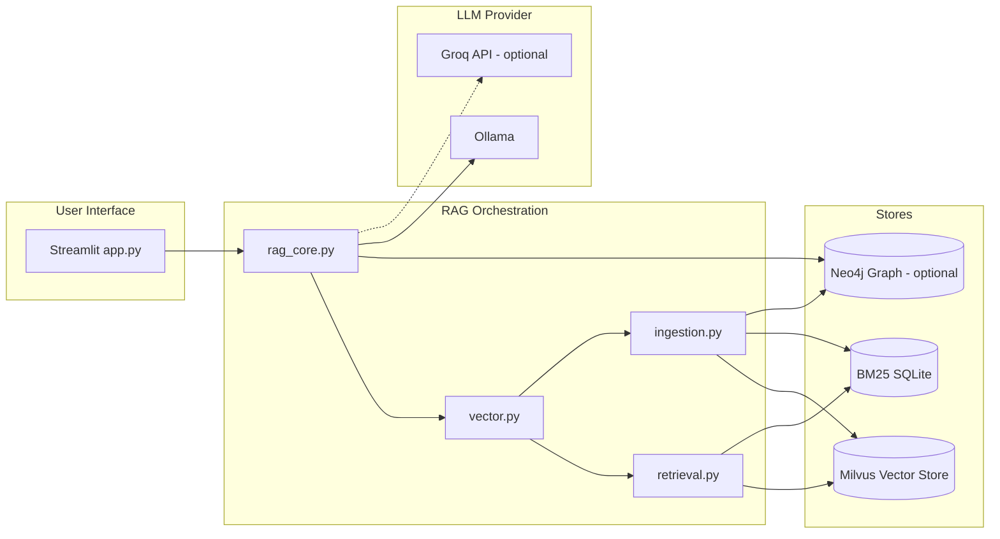
```mermaid
flowchart LR
  subgraph UI[User Interface]
    ST[Streamlit app.py]
  end

  subgraph CORE[RAG Orchestration]
    RC[rag_core.py]
    V[vector.py]
    R[retrieval.py]
    ING[ingestion.py]
  end

  subgraph STORES[Stores]
    MV[(Milvus Vector Store)]
    BM[(BM25 SQLite)]
    GS[(Neo4j Graph - optional)]
  end

  subgraph LLM[LLM Provider]
    OLL[Ollama]
    GRQ[Groq API - optional]
  end

  ST --> RC
  RC --> V
  V --> R
  V --> ING
  ING --> MV
  ING --> BM
  ING --> GS
  R --> MV
  R --> BM
  RC --> GS
  RC --> OLL
  RC -.-> GRQ
```

**Layer responsibilities:**

- **Streamlit UI (`app.py`)** — renders the chat interface, model picker, source provenance panel, and index management controls. All user interaction flows through here.
- **RAG Orchestration (`rag_core.py`, `vector.py`, `retrieval.py`)** — the core intelligence layer. Preprocesses queries, dispatches hybrid retrieval, applies knowledge injections, builds the prompt context, calls the LLM, and computes confidence.
- **Ingestion (`ingestion.py`)** — manages the incremental ingest loop: fingerprinting source files, chunking, embedding, and writing to all three stores.
- **Stores** — Milvus holds dense embeddings with rich metadata; BM25 SQLite holds a tokenized corpus for lexical recall; Neo4j (optional) holds a statute graph for structured traversal.
- **LLM Provider** — Ollama serves local models (Llama 3, Mistral, etc.). Groq is an optional cloud fallback for lower-latency generation.

---

## Data Flows

### Ingestion sequence

When `ensure_ingested()` is called (at startup or via the pipeline CLI), the following happens for each source file:

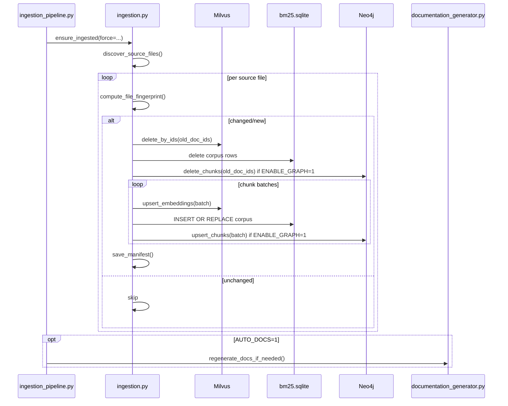
```mermaid
sequenceDiagram
  participant CLI as ingestion_pipeline.py
  participant ING as ingestion.py
  participant MV as Milvus
  participant BM as bm25.sqlite
  participant GS as Neo4j
  participant DOC as documentation_generator.py

  CLI->>ING: ensure_ingested(force=...)
  ING->>ING: discover_source_files()
  loop per source file
    ING->>ING: compute_file_fingerprint()
    alt changed/new
      ING->>MV: delete_by_ids(old_doc_ids)
      ING->>BM: delete corpus rows
      ING->>GS: delete_chunks(old_doc_ids) if ENABLE_GRAPH=1
      loop chunk batches
        ING->>MV: upsert_embeddings(batch)
        ING->>BM: INSERT OR REPLACE corpus
        ING->>GS: upsert_chunks(batch) if ENABLE_GRAPH=1
      end
      ING->>ING: save_manifest()
    else unchanged
      ING->>ING: skip
    end
  end
  opt AUTO_DOCS=1
    CLI->>DOC: regenerate_docs_if_needed()
  end
```

Files that haven't changed (same fingerprint as the stored manifest entry) are skipped entirely — this makes re-runs after adding a single PDF very fast regardless of how large the existing corpus is.

---

### Query sequence

When the user submits a query, the full RAG pipeline executes:

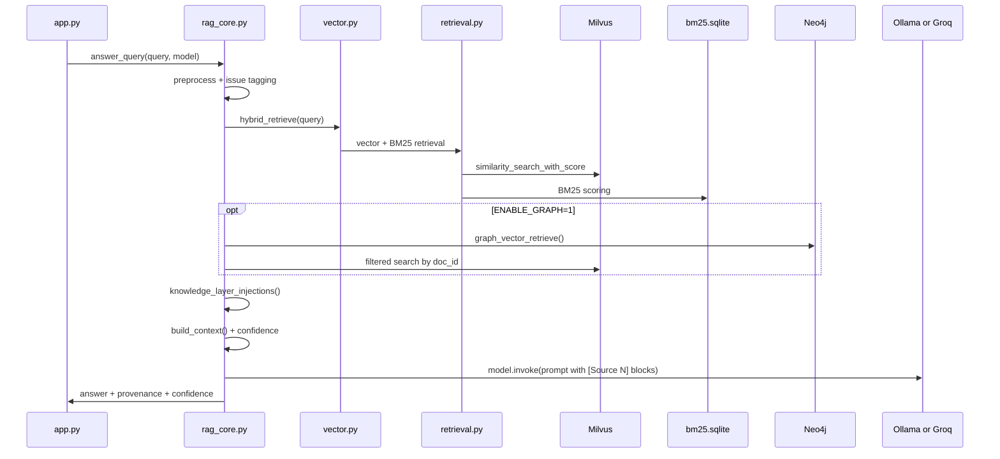
```mermaid
sequenceDiagram
  participant UI as app.py
  participant RC as rag_core.py
  participant V as vector.py
  participant R as retrieval.py
  participant MV as Milvus
  participant BM as bm25.sqlite
  participant GS as Neo4j
  participant LLM as Ollama or Groq

  UI->>RC: answer_query(query, model)
  RC->>RC: preprocess + issue tagging
  RC->>V: hybrid_retrieve(query)
  V->>R: vector + BM25 retrieval
  R->>MV: similarity_search_with_score
  R->>BM: BM25 scoring
  opt ENABLE_GRAPH=1
    RC->>GS: graph_vector_retrieve()
    RC->>MV: filtered search by doc_id
  end
  RC->>RC: knowledge_layer_injections()
  RC->>RC: build_context() + confidence
  RC->>LLM: model.invoke(prompt with [Source N] blocks)
  RC->>UI: answer + provenance + confidence
```

Issue tagging in the preprocessing step classifies the query (e.g., constitutional, criminal, contract) so that the prompt template and retrieval weighting can be tuned accordingly. The knowledge-layer injections step deterministically injects exact statutory text (by metadata match) before the LLM prompt is built, ensuring high-priority sections are always present regardless of retrieval scores.

---

## Additional Diagrams

### Graph Retrieval View (Optional)

When `ENABLE_GRAPH=1`, queries that reference an Act name or Section number are resolved through Neo4j first, producing a filtered candidate set that narrows the Milvus vector search.

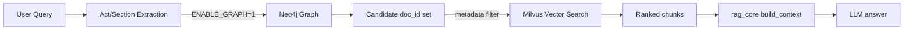
```mermaid
flowchart LR
  Q[User Query] --> TAG[Act/Section Extraction]
  TAG -->|ENABLE_GRAPH=1| NEO[Neo4j Graph]
  NEO --> CANDS[Candidate doc_id set]
  CANDS -->|metadata filter| MV[Milvus Vector Search]
  MV --> DOCS[Ranked chunks]
  DOCS --> RC[rag_core build_context]
  RC --> LLM[LLM answer]
```

This significantly reduces irrelevant chunks when the query is statute-specific (e.g., "What does Section 124A of IPC say?") by limiting the Milvus search space to chunks belonging to the matched Act and Section nodes.

---

### Deployment Topology

All stateful services (Milvus and its dependencies, optional Neo4j) run inside Docker. The Streamlit app and Ollama run directly on the host for easier GPU access and lower latency.

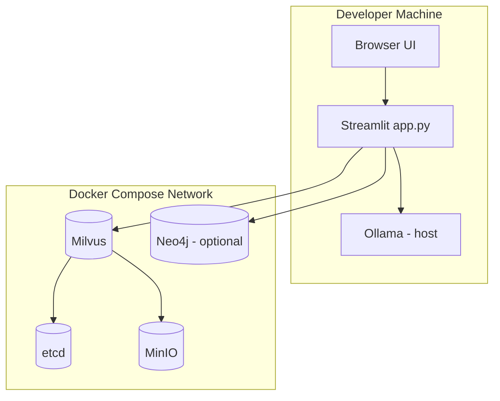
```mermaid
flowchart TB
  subgraph HOST[Developer Machine]
    UI[Browser UI]
    APP[Streamlit app.py]
    OLL[Ollama - host]
  end

  subgraph DOCKER[Docker Compose Network]
    MV[(Milvus)]
    ETCD[(etcd)]
    MINIO[(MinIO)]
    NEO[(Neo4j - optional)]
  end

  UI --> APP
  APP --> MV
  APP --> NEO
  APP --> OLL
  MV --> ETCD
  MV --> MINIO
```

Milvus requires etcd for metadata coordination and MinIO for object storage of segment data. Both are started automatically by the Compose stack and require no manual configuration.

---

### Storage Layout

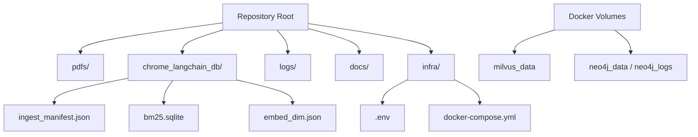
```mermaid
flowchart TB
  ROOT[Repository Root]
  ROOT --> PDFS[pdfs/]
  ROOT --> DB[chrome_langchain_db/]
  DB --> MAN[ingest_manifest.json]
  DB --> BM25[bm25.sqlite]
  DB --> DIM[embed_dim.json]
  ROOT --> LOGS[logs/]
  ROOT --> DOCS[docs/]
  ROOT --> INFRA[infra/]
  INFRA --> ENV[.env]
  INFRA --> COMPOSE[docker-compose.yml]

  VOLS[Docker Volumes]
  VOLS --> MVDATA[milvus_data]
  VOLS --> NEO4J[neo4j_data / neo4j_logs]
```

---

### Configuration Resolution Flow

On startup, all configuration is resolved from environment variables into typed config objects before any store connection is attempted.

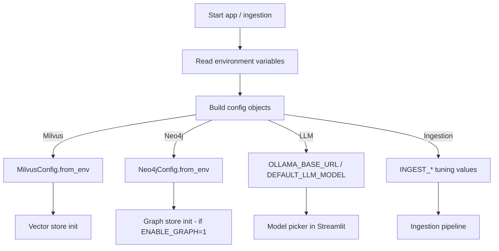
```mermaid
flowchart TD
  START[Start app / ingestion]
  START --> ENV[Read environment variables]
  ENV --> CFG[Build config objects]
  CFG -->|Milvus| MV[MilvusConfig.from_env]
  CFG -->|Neo4j| NEO[Neo4jConfig.from_env]
  CFG -->|LLM| LLM[OLLAMA_BASE_URL / DEFAULT_LLM_MODEL]
  CFG -->|Ingestion| INGEST[INGEST_* tuning values]
  MV --> VS[Vector store init]
  NEO --> GS[Graph store init - if ENABLE_GRAPH=1]
  LLM --> UI[Model picker in Streamlit]
  INGEST --> PIPE[Ingestion pipeline]
```

---

### Ingestion State and Lifecycle

The ingestion subsystem is a simple state machine. `rebuild_index()` is exposed in the Streamlit UI for manual full resets.

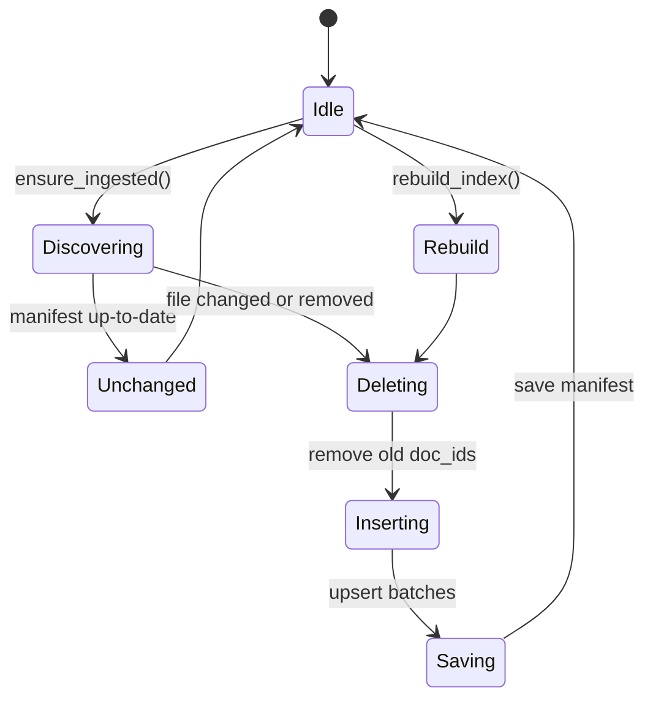
```mermaid
stateDiagram-v2
  [*] --> Idle
  Idle --> Discovering : ensure_ingested()
  Discovering --> Unchanged : manifest up-to-date
  Discovering --> Deleting : file changed or removed
  Deleting --> Inserting : remove old doc_ids
  Inserting --> Saving : upsert batches
  Saving --> Idle : save manifest
  Unchanged --> Idle
  Idle --> Rebuild : rebuild_index()
  Rebuild --> Deleting
```

---

### Retrieval Scoring Funnel

Retrieval is a multi-stage funnel that progressively narrows a large candidate pool down to the highest-quality context documents passed to the LLM.

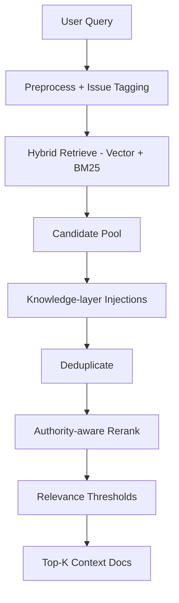
```mermaid
flowchart TB
  Q[User Query] --> PRE[Preprocess + Issue Tagging]
  PRE --> HYB[Hybrid Retrieve - Vector + BM25]
  HYB --> POOL[Candidate Pool]
  POOL --> INJ[Knowledge-layer Injections]
  INJ --> DEDUP[Deduplicate]
  DEDUP --> RERANK[Authority-aware Rerank]
  RERANK --> FILTER[Relevance Thresholds]
  FILTER --> TOP[Top-K Context Docs]
```

Each stage serves a specific purpose:
- **Preprocess + Issue Tagging** — normalises text, detects Acts/Sections referenced, and classifies the query domain.
- **Hybrid Retrieve** — runs Milvus ANN search and BM25 scoring in parallel, then fuses scores.
- **Knowledge-layer Injections** — deterministically inserts high-priority statutory chunks by metadata match.
- **Deduplicate** — removes duplicate `doc_id` entries from the merged pool.
- **Authority-aware Rerank** — boosts chunks from primary statute sources over commentary or derivative text; optionally applies a CrossEncoder for precision reordering.
- **Relevance Thresholds** — drops chunks below a minimum score to avoid polluting the context window.
- **Top-K** — selects the final context set passed to the prompt builder.

---

### Prompt + Citation Contract Flow

The prompt layer enforces a strict citation discipline. Answers that don't cite their sources are caught and penalised in the confidence score.

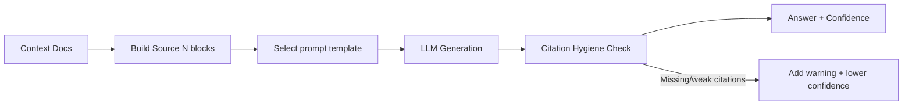
```mermaid
flowchart LR
  DOCS[Context Docs] --> CTX[Build Source N blocks]
  CTX --> PROMPT[Select prompt template]
  PROMPT --> LLM[LLM Generation]
  LLM --> CHECK[Citation Hygiene Check]
  CHECK --> OK[Answer + Confidence]
  CHECK -->|Missing/weak citations| WARN[Add warning + lower confidence]
```

Three prompt templates are in use:
- **General legal query** — broad context window, instructs the model to cite every factual claim.
- **Overview query** — used when the question asks for a summary of an Act or area of law; wider retrieval and a structured response format.
- **Clause enforceability query** — specialised template for questions about the enforceability or validity of contractual or statutory clauses, with stricter citation requirements.

---

### Graph Candidate Expansion (Sequence)

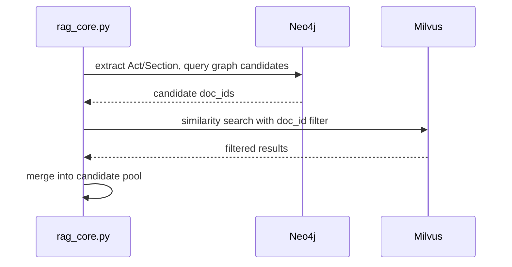
```mermaid
sequenceDiagram
  participant RC as rag_core.py
  participant GS as Neo4j
  participant MV as Milvus

  RC->>GS: extract Act/Section, query graph candidates
  GS-->>RC: candidate doc_ids
  RC->>MV: similarity search with doc_id filter
  MV-->>RC: filtered results
  RC->>RC: merge into candidate pool
```

---

### Error and Fallback Paths

NyayGram is designed to degrade gracefully. If the vector store is unavailable the user sees a clear actionable message; if the LLM fails and Groq is configured, the query is retried automatically.

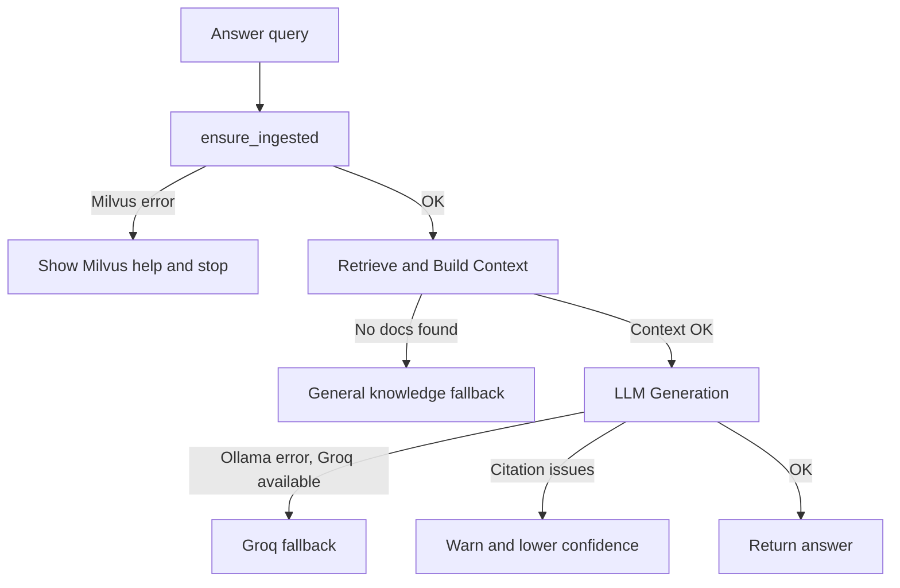
```mermaid
flowchart TB
  START[Answer query] --> ING[ensure_ingested]
  ING -->|Milvus error| MILVUS[Show Milvus help and stop]
  ING -->|OK| RET[Retrieve and Build Context]
  RET -->|No docs found| FALLBACK[General knowledge fallback]
  RET -->|Context OK| LLM[LLM Generation]
  LLM -->|Ollama error, Groq available| GROQ[Groq fallback]
  LLM -->|Citation issues| WARN[Warn and lower confidence]
  LLM -->|OK| DONE[Return answer]
```

---

## Repository Map

| Path | Purpose |
|---|---|
| `app.py` | Streamlit UI — chat interface, model picker, source provenance panel, index management. |
| `rag_core.py` | Core RAG orchestrator — query preprocessing, issue tagging, context building, prompt selection, confidence scoring, and LLM invocation. |
| `vector.py` | Compatibility facade — re-exports ingestion and retrieval functions under a stable API so `rag_core.py` doesn't depend directly on internal module layout. |
| `ingestion.py` | Incremental ingestion engine — file discovery, fingerprinting, chunking dispatch, Milvus upsert, BM25 corpus update, manifest management. |
| `retrieval.py` | Hybrid retrieval logic — Milvus + BM25 fusion, knowledge-layer injections, authority-aware reranking, relevance filtering, and citation prompt helpers. |
| `vector_store.py` | Milvus adapter — wraps `pymilvus` with a Chroma-compatible filter semantics interface so retrieval code stays store-agnostic. |
| `graph_store.py` | Neo4j adapter — schema creation, chunk upsert, Act/Section graph query, and connection management. |
| `orchestrator.py` | Graph-augmented retrieval orchestrator — coordinates `graph_store.py` queries with Milvus filtered search when `ENABLE_GRAPH=1`. |
| `embeddings.py` | Embedding providers — wraps Ollama embeddings and provides CrossEncoder utilities for optional reranking. |
| `chunking.py` | Document loading and chunking — PDF, Markdown, JSON, and TXT loaders; sliding window chunking; regex-based metadata extraction for Act, Section, Chapter, and Clause fields. |
| `ingestion_pipeline.py` | CLI entry point — runs `ensure_ingested()` and optionally triggers `documentation_generator.py` when `AUTO_DOCS=1`. |
| `documentation_generator.py` | Auto-generates `docs/ARCHITECTURE.md` from the live codebase when source files change. |
| `generation.py` | Offline conversion tool — batch-converts PDFs and JSON statute datasets to Markdown for inspection or pre-processing. |
| `main.py` | Lightweight CLI chat runner — terminal alternative to the Streamlit UI, useful for scripted testing. |
| `docs/ARCHITECTURE.md` | Auto-generated architecture snapshot — regenerated by `documentation_generator.py`. Do not edit manually. |
| `docs/TECHNICAL_DOCUMENTATION.md` | Long-form technical reference — deep dives into chunking strategy, scoring formulae, and prompt design. |
| `infra/` | Docker Compose stack — `docker-compose.yml` with Milvus, etcd, MinIO, and optional Neo4j; `.env.example` template. |
| `scripts/` | One-off operational utilities — index inspection helpers, migration scripts, and diagnostic tools. |
| `pdfs/` | Source documents — drop Indian statute PDFs here for ingestion. Subdirectories are supported. |
| `chrome_langchain_db/` | Local runtime state — ingestion manifest, BM25 SQLite corpus, and embedding dimension cache. Gitignored. |

---

## Ingestion Pipeline

### How it works

Ingestion is incremental and manifest-driven. The manifest (`chrome_langchain_db/ingest_manifest.json`) stores a fingerprint for each source file alongside the list of `doc_id` values it produced. On each run, only files whose fingerprint has changed (or that are new) are reprocessed. This makes routine re-runs after adding one PDF nearly instant regardless of corpus size.

### Source discovery

- All files under `pdfs/` with extensions in `SUPPORTED_EXTENSIONS` (`.pdf`, `.md`, `.txt`) are discovered recursively.
- Optional structured JSON datasets (e.g., section-level statute databases) are listed in `JSON_FILES` inside `ingestion.py` and ingested alongside document files.

### Chunking and metadata extraction

`chunking.py` handles loading and chunking for each format:

- **PDF** — text is extracted page by page, then split using a sliding window chunker with configurable overlap.
- **Markdown / TXT** — split by heading boundaries where possible, falling back to character-based chunking.
- **JSON** — each record is treated as a pre-chunked document; fields are mapped to metadata.

For all formats, a regex pass over the chunk text attempts to extract:
- `act` — the name of the Indian statute (e.g., "Indian Penal Code", "Companies Act 2013").
- `section` — section number referenced in or near the chunk.
- `subsection`, `clause`, `chapter` — finer-grained structural metadata where present.
- `citation` — any citation string found in the text.

This metadata is stored in Milvus and used for both filtered retrieval and graph node creation.

### Store writes

For each changed file, the pipeline:
1. Deletes all existing records for old `doc_id` values from Milvus, BM25, and Neo4j (if enabled).
2. Generates embeddings in batches (controlled by `INGEST_BATCH_SIZE`).
3. Upserts embeddings and metadata into Milvus.
4. Writes tokenized text into the BM25 SQLite corpus.
5. If `ENABLE_GRAPH=1`, creates or updates Act, Section, and Chunk nodes in Neo4j.
6. Saves the updated manifest entry.

### BM25 corpus

The SQLite BM25 corpus at `chrome_langchain_db/bm25.sqlite` is a simple inverted index over chunk text. It provides lexical recall for queries where exact statutory wording matters — section numbers, defined terms, and Act names that might not be well-represented in the dense embedding space.

### Graph layer

When `ENABLE_GRAPH=1`, each chunk is written to Neo4j with the following node structure:

- `(:Act {name})` — one node per unique Act name.
- `(:Section {key, act, section, ...})` — one node per unique Act+Section combination.
- `(:Chunk {doc_id, text, ...})` — one node per chunk, linked to its Section.

`CITES` relationships between Section nodes are created when citation metadata is present, enabling future traversal of cross-statute references.

---

## Retrieval and Answering Pipeline

### Hybrid retrieval

Retrieval is the core of NyayGram's accuracy. The hybrid approach fuses two complementary signals:

**Milvus semantic search** — embeds the query using the same model used during ingestion, then runs approximate nearest-neighbour search over the dense vector index. This catches semantically related passages even when the exact words differ. Metadata filters (Act name, doc type, date range) can be applied to restrict the search space.

**BM25 lexical search** — tokenises the query and scores corpus documents using TF-IDF-style term weighting. This ensures statutory phrases, section numbers, and defined legal terms are reliably recalled even when their embedding is crowded by similar-sounding but unrelated text.

The two score lists are fused using a weighted combination. The weights are tunable but default to equal contribution.

### Graph augmentation

When `ENABLE_GRAPH=1` and the query contains recognisable Act or Section references, `orchestrator.py` queries Neo4j to extract a set of candidate `doc_id` values. These are passed as a metadata filter to the Milvus search, constraining results to chunks that belong to the matched statutory nodes. This is especially effective for precise queries like "What is the punishment under Section 302 IPC?" where the graph can immediately narrow scope.

### Knowledge-layer injections

After the retrieval pool is built, a deterministic injection step runs. It queries Milvus directly by metadata filter (not by embedding similarity) to pull specific statutory sections that are always relevant to the detected issue type. For example, constitutional queries always inject the relevant Fundamental Rights articles regardless of their retrieval score. This ensures the LLM always has the anchor text it needs.

### Cross-encoder reranking

After fusion and deduplication, an optional CrossEncoder (default: `cross-encoder/ms-marco-MiniLM-L-6-v2`) re-scores each `(query, chunk)` pair for precision ordering. The CrossEncoder is slower than the bi-encoder used for embedding but significantly more accurate for relevance judgement since it attends to both query and document jointly. It is skipped gracefully if the model is not installed.

### Prompt construction and citation contract

The final context set is serialised into numbered `[Source N]` blocks and injected into the prompt. The system prompt instructs the model to:
- Answer only from the provided sources.
- Cite every factual claim using `[Source N]` inline.
- State explicitly when the sources do not contain enough information to answer.

Post-generation, a citation hygiene check verifies that the response contains inline citations proportional to the number of factual claims. Responses that fail this check receive a lower confidence score and a warning displayed in the UI.

### Confidence scoring

The confidence score (0–1) is a composite of:
- **Source authority** — whether the retrieved chunks come from primary statute sources vs. commentary.
- **Statutory coverage** — whether chunks matching the detected Acts and Sections were retrieved.
- **Citation density** — the ratio of cited claims to total factual statements in the response.
- **Retrieval score distribution** — whether the top chunk scores are clearly above the threshold or borderline.

---

## Data Model

### Document IDs

Each chunk is assigned a stable, deterministic `doc_id` of the form:

```
relative_path:chunk_index:file_hash_prefix
```

For example: `pdfs/ipc_1860.pdf:142:a3f7b2`. The hash prefix is derived from the file content fingerprint, so if the file changes, all its `doc_id` values change and old records are deleted before reinsertion.

### Milvus collection schema

| Field | Type | Description |
|---|---|---|
| `doc_id` | VARCHAR (PK) | Stable chunk identifier |
| `text` | VARCHAR | Raw chunk text |
| `embedding` | FLOAT_VECTOR | Dense embedding vector |
| `doc_type` | VARCHAR | Source document type (`statute`, `judgment`, `commentary`) |
| `source` | VARCHAR | Display name of the source document |
| `source_path` | VARCHAR | Relative path to the source file |
| `act` | VARCHAR | Extracted Act name |
| `section` | VARCHAR | Extracted section number |
| `subsection` | VARCHAR | Extracted subsection |
| `clause` | VARCHAR | Extracted clause |
| `citation` | VARCHAR | Extracted citation string |
| `char_count` | INT64 | Character length of the chunk |
| `metadata_json` | VARCHAR | Full metadata as a JSON blob for arbitrary fields |

### Neo4j graph schema

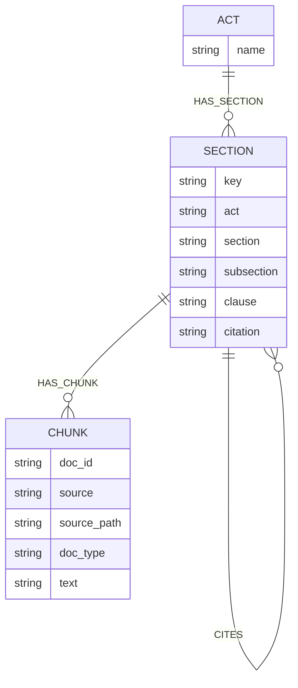
```mermaid
erDiagram
  ACT ||--o{ SECTION : HAS_SECTION
  SECTION ||--o{ CHUNK : HAS_CHUNK
  SECTION ||--o{ SECTION : CITES

  ACT {
    string name
  }

  SECTION {
    string key
    string act
    string section
    string subsection
    string clause
    string citation
  }

  CHUNK {
    string doc_id
    string source
    string source_path
    string doc_type
    string text
  }
```

The `CITES` relationship between Section nodes is populated when citation metadata is present, enabling graph traversal of statutory cross-references (e.g., "Section 420 IPC as amended by IT Act Section 66").

---

## Storage and State

### Local state (`chrome_langchain_db/`)

| File | Purpose |
|---|---|
| `ingest_manifest.json` | Maps each source file path to its fingerprint and list of generated `doc_id` values. The basis for incremental ingestion. |
| `bm25.sqlite` | SQLite database holding the tokenized BM25 corpus. Maintained in sync with Milvus. |
| `embed_dim.json` | Caches the embedding dimension detected from the active Ollama model. Used to validate the Milvus collection schema on startup. |

This directory is gitignored and rebuilt automatically. You can safely delete it to force a full re-ingest.

### Docker volumes

| Volume | Contents |
|---|---|
| `milvus_data` | Milvus segment data (actual vector index and raw vectors). |
| `etcd_data` | etcd key-value store used by Milvus for collection metadata. |
| `minio_data` | MinIO object store used by Milvus for segment file storage. |
| `neo4j_data` | Neo4j graph database files (only present when the graph profile is active). |
| `neo4j_logs` | Neo4j logs. |

To fully reset the vector index, stop Docker, remove the `milvus_data` volume, delete `chrome_langchain_db/`, and re-run ingestion.

### Logs

All runtime logs and per-query response traces are written under `logs/`. Log files include:
- LLM prompt and response for each query (useful for debugging hallucination or citation failures).
- Retrieval scores and chunk previews.
- Ingestion progress and timing.

---

## Configuration Reference

### Core services

| Variable | Default | Description |
|---|---|---|
| `MILVUS_HOST` | `localhost` | Milvus gRPC host. |
| `MILVUS_PORT` | `19530` | Milvus gRPC port. |
| `MILVUS_COLLECTION` | `nyaygram` | Milvus collection name. Changing this creates a new isolated index. |
| `ENABLE_GRAPH` | `0` | Set to `1` to enable Neo4j graph writes and graph-augmented retrieval. |
| `NEO4J_URI` | `bolt://localhost:7687` | Neo4j Bolt URI. |
| `NEO4J_USER` | `neo4j` | Neo4j username. |
| `NEO4J_PASSWORD` | _(none)_ | Neo4j password. Required if `ENABLE_GRAPH=1`. |
| `NEO4J_DATABASE` | `neo4j` | Neo4j database name. |

### LLM providers

| Variable | Default | Description |
|---|---|---|
| `OLLAMA_BASE_URL` | `http://localhost:11434` | Ollama API base URL. Use `http://host.docker.internal:11434` if the app runs inside Docker. |
| `OLLAMA_HOST` | _(alias)_ | Alternative to `OLLAMA_BASE_URL`; either works. |
| `DEFAULT_LLM_MODEL` | `llama3` | Default Ollama model. Any model pulled with `ollama pull` is usable. |
| `GROQ_API_KEY` | _(none)_ | Enables Groq as a cloud LLM fallback when set. |
| `DEFAULT_GROQ_MODEL` | `llama3-70b-8192` | Groq model to use when `GROQ_API_KEY` is set. |
| `OPENAI_API_KEY` | _(none)_ | Enables Whisper audio transcription in the UI when set. |

### Reranking

| Variable | Default | Description |
|---|---|---|
| `CROSS_ENCODER_MODEL` | `cross-encoder/ms-marco-MiniLM-L-6-v2` | HuggingFace model ID for the CrossEncoder reranker. |
| `CROSS_ENCODER_DEVICE` | `auto` | Device for reranker inference: `cpu`, `cuda`, or `auto` (uses CUDA if available). |
| `CROSS_ENCODER_BATCH_SIZE` | `32` | Batch size for CrossEncoder scoring. Reduce if running out of memory. |

### Documentation

| Variable | Default | Description |
|---|---|---|
| `AUTO_DOCS` | `1` | Set to `0` to disable auto-regeneration of `docs/ARCHITECTURE.md` on ingestion runs. |

### Ingestion tuning

These variables control memory usage and throughput during ingestion. The defaults are conservative and suitable for a developer machine. Increase batch sizes for faster ingestion on machines with more RAM.

| Variable | Default | Description |
|---|---|---|
| `INGEST_BATCH_SIZE` | `64` | Number of chunks to embed per batch. |
| `INGEST_INSERT_BATCH` | `100` | Number of records per Milvus insert call. |
| `INGEST_DOCS_PER_FLUSH` | `500` | Number of documents between manifest flush operations. |
| `INGEST_FLUSH_STRATEGY` | `periodic` | `periodic` or `immediate`. |
| `INGEST_MANIFEST_SAVE_INTERVAL` | `50` | Number of files processed between manifest saves. |
| `INGEST_START_INDEX` | `0` | Skip the first N source files — useful for resuming interrupted ingestion. |
| `INGEST_MAX_MEM_GB` | `4.0` | Maximum memory usage before ingestion pauses to flush. |

---

## Deployment

### Local Docker Compose (standard)

Starts Milvus and its dependencies (etcd, MinIO). Neo4j is not included by default.

```powershell
Copy-Item infra/.env.example infra/.env
# Edit infra/.env with your settings

docker compose -f infra/docker-compose.yml --env-file infra/.env up -d --build
```

Check that all containers are healthy before starting the app:

```powershell
docker compose -f infra/docker-compose.yml ps
```

---

### Run ingestion as a container

Runs `ingestion_pipeline.py` inside a container connected to the Docker network (useful in CI or when you don't want to install Python locally):

```powershell
docker compose -f infra/docker-compose.yml --env-file infra/.env --profile ingest up --build ingestion
```

---

### Enable the Neo4j graph layer

Start Neo4j alongside the standard stack using the `graph` profile:

```powershell
docker compose -f infra/docker-compose.yml --env-file infra/.env --profile graph up -d neo4j
```

Then set `ENABLE_GRAPH=1` in `infra/.env` and restart the app. The graph schema is created automatically on first connection.

---

### Tear down and clean state

```powershell
# Stop all containers
docker compose -f infra/docker-compose.yml down

# Remove all volumes (deletes all indexed data — requires full re-ingest)
docker compose -f infra/docker-compose.yml down -v

# Also clear local state
Remove-Item -Recurse chrome_langchain_db/
```

---

## Operations and Troubleshooting

### Milvus unavailable on startup

**Symptom:** The app shows a Milvus connection error immediately after launch.

**Fix:**
1. Verify Docker Desktop is running.
2. Check that all three Milvus-related containers (milvus, etcd, minio) are healthy: `docker compose -f infra/docker-compose.yml ps`.
3. Confirm `MILVUS_HOST` and `MILVUS_PORT` in your `.env` match the container port mappings.
4. On some machines, the Milvus container takes 30–60 seconds to become ready after `docker compose up`. Wait and retry.

---

### Embedding dimension mismatch

**Symptom:** Ingestion fails with a schema or dimension error, or retrieval returns no results after changing the Ollama model.

**Cause:** The Milvus collection was created with the embedding dimension of a previous model. The new model produces vectors of a different size.

**Fix:**
1. Set `EMBEDDING_DIM` in `.env` to match the new model's output dimension.
2. Or delete the existing collection and `chrome_langchain_db/embed_dim.json`, then re-run ingestion to let the schema be recreated.

---

### Empty retrieval results

**Symptom:** Queries return "I could not find relevant sources" for topics that should be covered.

**Checklist:**
1. Verify source PDFs exist in `pdfs/` and have the correct extensions.
2. Check `chrome_langchain_db/ingest_manifest.json` to confirm the files were ingested.
3. Run `python ingestion_pipeline.py --force` to force a full re-ingest.
4. Check `logs/` for embedding errors during ingestion.
5. Verify Ollama is running and the embedding model is pulled: `ollama list`.

---

### Ollama not responding

**Symptom:** Queries time out or return an LLM connection error.

**Fix:**
1. Ensure Ollama is running on the host: `ollama serve`.
2. Confirm `OLLAMA_BASE_URL` is set correctly. If the app runs inside Docker, use `http://host.docker.internal:11434` instead of `localhost`.
3. Pull the model if not already downloaded: `ollama pull llama3`.

---

### Logs

All query traces and ingestion logs are written to `logs/`. Log files are named with a timestamp and include:
- The full prompt sent to the LLM.
- Retrieved chunk previews and scores.
- The LLM's raw response before citation checking.
- Confidence score breakdown.

---

## Development Notes

### Running the CLI chat interface

For quick testing without the Streamlit UI:

```powershell
python main.py
```

### Performance testing

`test_performance.py` runs a set of representative queries against the live index and reports retrieval latency, reranking time, and end-to-end response time:

```powershell
python test_performance.py
```

### Adding new source documents

1. Drop PDFs into `pdfs/` (subdirectories are fine).
2. Run `python ingestion_pipeline.py` or restart the app — ingestion runs automatically on the next query.
3. Only the new files are processed; existing indexed documents are untouched.

### Extending metadata extraction

Metadata extraction is regex-based and lives in `chunking.py`. To add a new field (e.g., extracting amendment year), add a regex pattern to the extraction function and add the field to the Milvus collection schema in `vector_store.py`.

### Switching embedding models

1. Pull the new model in Ollama: `ollama pull <model-name>`.
2. Update `DEFAULT_LLM_MODEL` (or set a dedicated `EMBEDDING_MODEL` variable if you want a separate model for embeddings vs. generation).
3. Delete `chrome_langchain_db/embed_dim.json` and drop the existing Milvus collection.
4. Re-run ingestion.

### Auto-documentation

When `AUTO_DOCS=1` (the default), running `ingestion_pipeline.py` will regenerate `docs/ARCHITECTURE.md` if any source files have changed since the last generation. To disable: set `AUTO_DOCS=0` in your environment.

---

## Contributing

Contributions are welcome. A few guidelines:

- **New source documents** — place PDFs in `pdfs/` with clear filenames (e.g., `companies_act_2013.pdf`). Avoid committing very large files; link to a public source instead.
- **Code style** — the project uses `black` for formatting and `ruff` for linting. Run both before submitting a PR.
- **Tests** — add retrieval regression tests to `test_performance.py` for any new query types or prompt templates.
- **Configuration** — new environment variables should be documented in `infra/.env.example` and in the [Configuration Reference](#configuration-reference) table above.

---

> **Docs note:** `docs/ARCHITECTURE.md` is auto-generated — do not edit it manually. `docs/TECHNICAL_DOCUMENTATION.md` is the place for deep-dive design notes and is hand-maintained.
