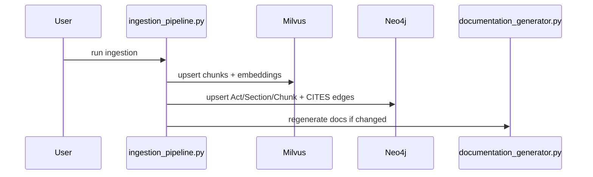
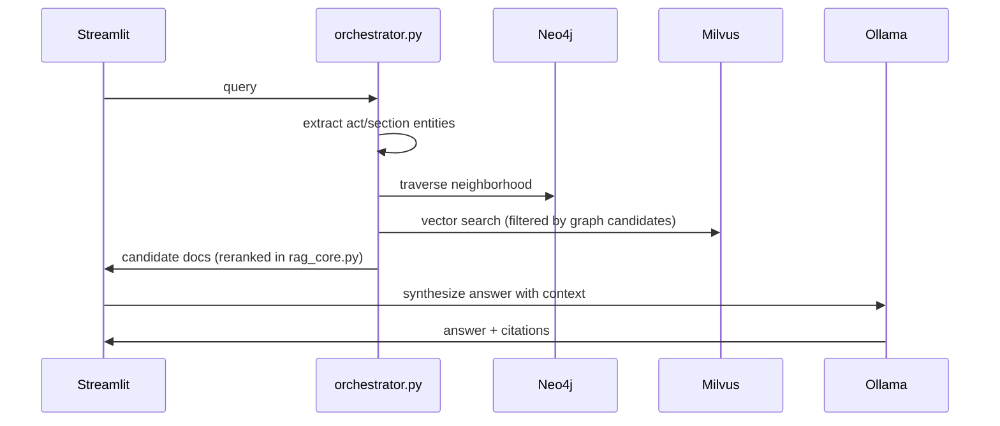

# LegalAid AI — Hybrid Legal RAG Architecture (Milvus + Neo4j)

Generated by `documentation_generator.py`. This document is intended to stay in sync with the codebase.

## Architecture Overview

```mermaid
flowchart LR
  subgraph UI[Streamlit Frontend]
    st[Streamlit App]
  end

  subgraph ORCH[Orchestration Layer (Python)]
    router[Query Router]
    ent[Entity Extraction]
    graphq[Graph Traversal]
    vecq[Vector Retrieval]
    rr[Reranking]
    conf[Confidence Scoring]
    ctx[Context Builder]
    llm[LLM Synthesis (Ollama)]
  end

  subgraph VEC[Vector Layer]
    milvus[(Milvus)]
  end

  subgraph GDB[Graph Layer]
    neo4j[(Neo4j)]
  end

  st --> router --> ent
  ent --> graphq --> neo4j
  ent --> vecq --> milvus
  graphq --> vecq
  vecq --> rr --> conf --> ctx --> llm --> st
```

## Technology Choices & Trade-offs

- **Milvus over Chroma**: better scaling characteristics (collections, indexing options, durability via external storage), robust filtering/search at larger sizes. Trade-offs: operational complexity (services + monitoring), schema/index management.
- **Neo4j graph layer**: enables Act/Section neighborhood traversal (e.g., *Section 27* → cited/related sections) and deterministic structure-aware filtering; helps recall/precision for statute-heavy queries. Trade-offs: extra ingestion complexity and eventual consistency between vector+graph stores.
- **Hybrid retrieval**: vector similarity (semantic) + BM25 (lexical) improves legal retrieval where exact statutory phrasing matters.

## Deployment Architecture

Local Docker Compose: `infra/docker-compose.yml` brings up:
- Milvus (etcd + minio + standalone) on `localhost:19530`
- Neo4j on `localhost:7687` / `localhost:7474`

## Vector Schema (Milvus)

Collection: `indian_legal_rag`
- Primary key: `doc_id` (stable IDs preserved)
- Vector: `embedding` (FloatVector, dim=(auto-detected at runtime), metric=COSINE)
- Payload: `text` + core metadata fields (`act`, `section`, `doc_type`, `source`, etc.)
- Full metadata preserved in `metadata_json` for forward compatibility

Index recommendation:
- Default: **HNSW** for low-latency + good recall on medium-sized corpora
- Consider IVF_FLAT/IVF_PQ for multi-million scale or constrained memory

## Graph Schema (Neo4j)

Nodes (requested):
- `(:Act {name})`
- `(:Section {key, act, section, subsection, clause, citation})`
- `(:Case {name})` (reserved for future extraction improvements)
- `(:Amendment {id})` (reserved)

Additional node (practical necessity for chunk-level retrieval):
- `(:Chunk {doc_id, source, source_path, doc_type})`

Relationships:
- `(Act)-[:HAS_SECTION]->(Section)`
- `(Section)-[:HAS_CHUNK]->(Chunk)`
- `(Section)-[:CITES]->(Section)` (heuristic extraction from chunk text)

## Data Flow

```mermaid
flowchart TB
  A[PDF/MD/JSON sources] --> B[Chunking + Metadata]
  B --> C[Embedding (OllamaEmbeddings)]
  C --> D[Milvus upsert]
  B --> E[Neo4j upsert]
  D --> F[Hybrid Retrieval]
  E --> F
  F --> G[Rerank + Confidence]
  G --> H[LLM Answer]
```

## Sequence Diagrams

### Ingestion


### User Query


## Scaling & Performance Considerations

- **Milvus index selection**
  - HNSW: best general-purpose for interactive latency.
  - IVF_*: better memory scaling; requires tuning `nlist/nprobe`.
- **Batching**
  - Keep embedding batch sizes conservative (Ollama can OOM on huge batches).
  - Use `BATCH_SIZE=32` as a safe default; increase carefully with monitoring.
- **Metadata filtering**
  - Prefer short equality filters (`act`, `source`, `doc_type`).
  - Avoid very large `doc_id in [...]` filters; cap and backfill with global retrieval.
- **Neo4j**
  - Add constraints (done) and keep traversals bounded (`cite_hops`, `limit`).

## Failure Handling

- Vector store failures: retried vector search (`VECTOR_QUERY_RETRIES`) and BM25 fallback.
- Ingestion failures: batch-level try/except; continues on partial failures; maintains manifest.
- Graph layer: optional behind `ENABLE_GRAPH=1`; failures degrade gracefully to vector-only retrieval.

## When Milvus Migration Is Worth It

- Worth it when:
  - Corpus is large (hundreds of thousands+ chunks) and query latency/recall need stronger indexing
  - You need richer server-side filtering, durability, and operational controls
- Chroma may still be sufficient when:
  - Corpus is small and you want minimal infrastructure and fast iteration

## Risks

- Operational complexity (Milvus + Neo4j services, backups, monitoring)
- Schema drift (metadata fields) — mitigated via `metadata_json`
- Embedding dimension mismatch — mitigated via runtime probe + `EMBEDDING_DIM` override

## Roadmap

- Case-law entity extraction (Case nodes + CITES/INTERPRETS/OVERRULES edges)
- Section-level canonicalization across Acts + cross-act citations
- Partitioning by `act` / `doc_type` in Milvus for performance isolation
- Async ingestion + background index builds
